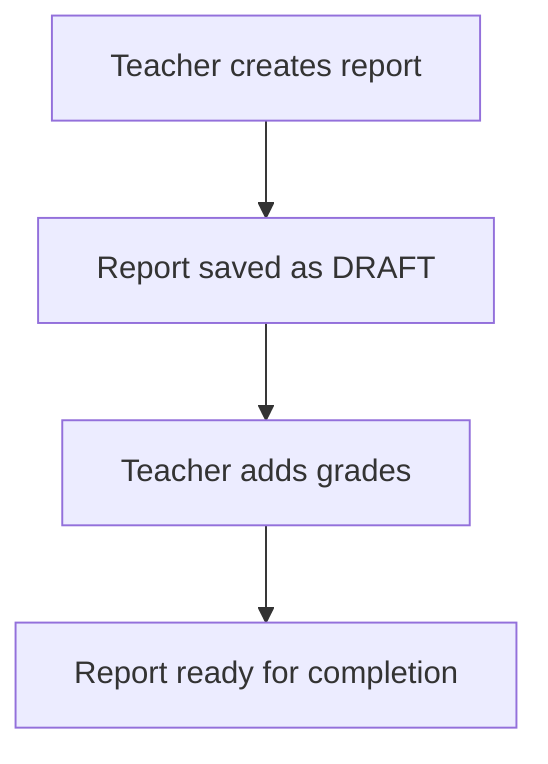
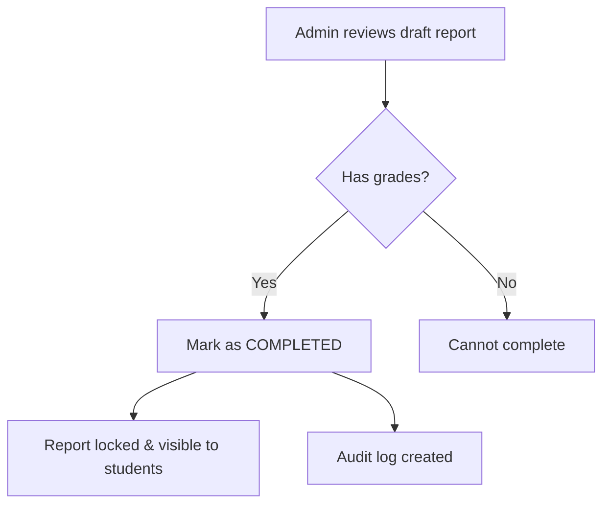

# SmartED Report Workflow System

This document describes the enhanced report workflow system implemented in SmartED, which provides comprehensive report status management with proper separation between backend and frontend logic.

## Overview

The new system introduces a two-state workflow for reports:
- **Draft**: Reports that are still being worked on and can be edited
- **Completed**: Reports that are finalized, locked, and visible to students/parents

## Key Features

### 🔒 **Status-Based Access Control**
- Only **completed** reports are visible to students and parents
- **Draft** reports are only accessible to admin and faculty for editing
- Automatic status validation on all report operations

### 👨‍💼 **Admin Controls**
- Mark reports as completed (locks them for editing)
- Revert completed reports back to draft (with reason tracking)
- View all reports regardless of status
- Complete audit trail of all actions

### 🛡️ **Backend Validation**
- All report operations go through backend API validation
- Role-based permissions enforced at API level
- Audit logging for compliance and tracking
- Database triggers for automatic status tracking

### 📊 **Enhanced Reporting**
- Status-aware statistics and analytics
- Draft vs completed report counts
- Completion timeline tracking
- Performance metrics based only on completed reports

## Architecture

### Backend (Separated from Frontend)

#### Database Schema Changes
```sql
-- New columns added to student_reports table
ALTER TABLE student_reports 
ADD COLUMN status VARCHAR(20) DEFAULT 'draft' CHECK (status IN ('draft', 'completed'));
ADD COLUMN completed_at TIMESTAMP NULL;
ADD COLUMN completed_by UUID REFERENCES profiles(id);

-- New audit_logs table for tracking all operations
CREATE TABLE audit_logs (
  id UUID DEFAULT gen_random_uuid() PRIMARY KEY,
  user_id UUID REFERENCES profiles(id),
  action VARCHAR(100) NOT NULL,
  resource_type VARCHAR(50) NOT NULL,
  resource_id VARCHAR(100),
  details JSONB DEFAULT '{}',
  timestamp TIMESTAMP WITH TIME ZONE DEFAULT NOW()
);
```

#### API Endpoints
- `getReportsByStatus(status, filters)` - Fetch reports by status with filtering
- `getReportById(reportId, includeIncomplete)` - Get single report with status validation
- `completeReport(reportId)` - Mark report as completed (admin only)
- `revertReportToDraft(reportId, reason)` - Revert to draft with reason (admin only)
- `canEditReport(reportId)` - Check if report can be edited
- `getReportStatistics(filters)` - Get status-aware statistics

#### Permission System
```javascript
const PERMISSIONS = {
  admin: ['view_reports', 'edit_reports', 'manage_reports', 'complete_reports'],
  faculty: ['view_reports', 'edit_reports', 'view_assigned_students'],
  student: ['view_own_reports'],
  guardian: ['view_child_reports']
}
```

### Frontend Components

#### Updated Components
1. **ClassReportsPage** - Now shows status indicators and admin controls
2. **ReportViewer** - Handles incomplete reports with appropriate messaging
3. **StudentDashboard** - Only displays completed reports
4. **AdminDashboard** - Removed "Generate Report" buttons

#### New UI Features
- Status badges (Draft/Completed) on all report cards
- Admin action buttons (Complete/Revert) with appropriate permissions
- Modal for reverting reports with reason requirement
- Enhanced statistics showing draft vs completed counts
- Incomplete report messaging for students/parents

## Workflow

### 1. Report Creation


### 2. Report Completion (Admin Only)


### 3. Student/Parent Access
```mermaid
graph TD
    A[Student accesses dashboard] --> B[Fetch COMPLETED reports only]
    B --> C{Reports found?}
    C -->|Yes| D[Display full reports]
    C -->|No| E[Show "not finalized" message]
```

## Usage Guide

### For Administrators

#### Completing a Report
1. Navigate to Class Management → Class Reports
2. Find the draft report you want to complete
3. Ensure the report has grades assigned
4. Click the "Complete" button (✓)
5. Report is now locked and visible to students

#### Reverting a Report
1. Find a completed report
2. Click the "Revert" button (🔓)
3. Provide a detailed reason (minimum 10 characters)
4. Confirm the action
5. Report returns to draft status for editing

### For Teachers

#### Working with Draft Reports
1. Create reports as usual - they start as drafts
2. Add/edit grades while in draft status
3. Reports remain editable until admin marks as completed
4. Use Class Reports view to see status of all reports

### For Students/Parents

#### Viewing Reports
1. Access Student Dashboard
2. Only completed reports will be displayed
3. Draft reports show "not yet finalized" message
4. All visible reports are in their final form

## Configuration

### Environment Variables
```bash
# Backend configuration
SUPABASE_SERVICE_KEY=your_service_role_key_here

# Frontend configuration
REACT_APP_SUPABASE_URL=your_supabase_url
REACT_APP_SUPABASE_ANON_KEY=your_anon_key
```

### Database Setup
1. Run migration: `migrations/add_report_status.sql`
2. Run migration: `migrations/create_audit_logs.sql`
3. Verify triggers and functions are created
4. Update existing reports to appropriate status

## Security Features

### Row Level Security (RLS)
- Audit logs only viewable by admins
- Students can only access their own completed reports
- Faculty can only access reports for their assigned students

### API Security
- All operations require authentication
- Role-based access control on all endpoints
- Audit logging for compliance
- Input validation and sanitization

### Frontend Security
- Status validation before rendering
- Permission-based UI element display
- Secure routing with role checks

## Troubleshooting

### Common Issues

#### Reports Not Showing for Students
- **Cause**: Reports are still in draft status
- **Solution**: Admin needs to complete the reports first

#### Cannot Complete Report
- **Cause**: Report has no grades assigned
- **Solution**: Add grades before marking as completed

#### Permission Denied
- **Cause**: User doesn't have required role permissions
- **Solution**: Check user role and API permissions

### Debug Mode
Enable debug logging by setting:
```javascript
console.log('Debug mode enabled');
// Add to frontend components for detailed status logging
```

## Migration Guide

### From Old System
1. Backup existing data
2. Run database migrations
3. Update frontend components to use new API
4. Test with sample data
5. Deploy and verify

### Data Migration
- Existing reports with grades → marked as 'completed'
- Reports without grades → remain as 'draft'
- All changes logged in audit table

## API Reference

### Report Status Constants
```javascript
export const REPORT_STATUS = {
  DRAFT: 'draft',
  COMPLETED: 'completed'
}
```

### Error Codes
- `401`: Authentication required
- `403`: Insufficient permissions
- `404`: Report not found
- `400`: Cannot complete report without grades

## Performance Considerations

- Indexes added for status-based queries
- Audit log cleanup function for maintenance
- Efficient filtering at database level
- Minimal frontend re-renders with proper state management

## Future Enhancements

- Email notifications when reports are completed
- Bulk operations for multiple reports
- Advanced analytics and reporting
- Integration with external grading systems
- Mobile app support with offline capability

---

For technical support or questions about this system, please contact the development team. 